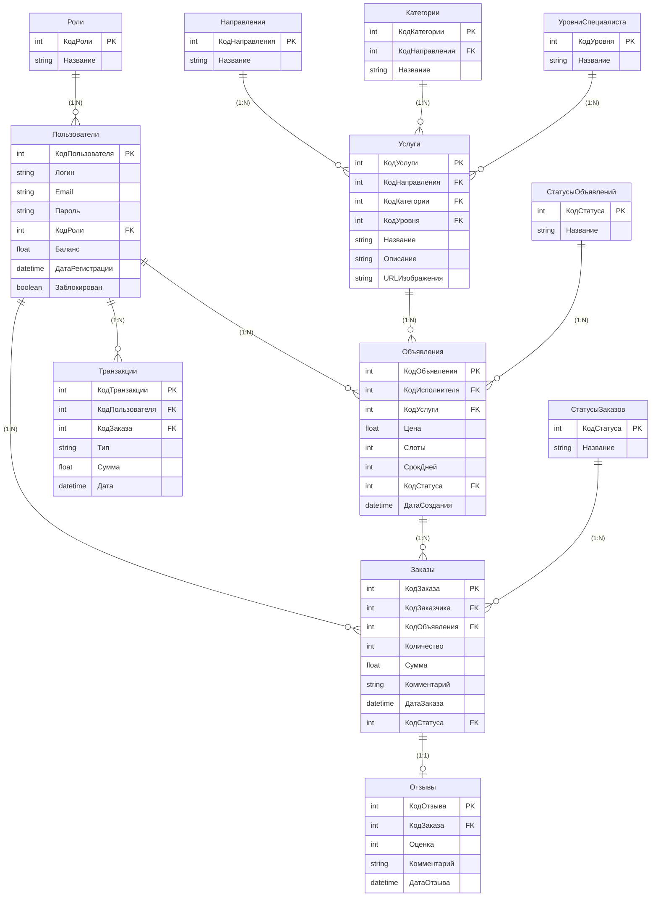

```mermaid
erDiagram
    Пользователи ||--o{ Объявления : " (1:N)"
    Пользователи ||--o{ Заказы : " (1:N)"
    Пользователи ||--o{ Транзакции : " (1:N)"
    Услуги ||--o{ Объявления : " (1:N)"
    Объявления ||--o{ Заказы : " (1:N)"
    Заказы ||--o| Отзывы : " (1:1)"
    
    Направления ||--o{ Услуги : " (1:N)"
    Категории ||--o{ Услуги : " (1:N)"
    УровниСпециалиста ||--o{ Услуги : " (1:N)"
    Роли ||--o{ Пользователи : " (1:N)"
    СтатусыОбъявлений ||--o{ Объявления : " (1:N)"
    СтатусыЗаказов ||--o{ Заказы : " (1:N)"

    Пользователи {
        int КодПользователя PK
        string Логин
        string Email
        string Пароль
        int КодРоли FK
        float Баланс
        datetime ДатаРегистрации
        boolean Заблокирован
    }

    Услуги {
        int КодУслуги PK
        int КодНаправления FK
        int КодКатегории FK
        int КодУровня FK
        string Название
        string Описание
        string URLИзображения
    }

    Объявления {
        int КодОбъявления PK
        int КодИсполнителя FK
        int КодУслуги FK
        float Цена
        int Слоты
        int СрокДней
        int КодСтатуса FK
        datetime ДатаСоздания
    }

    Заказы {
        int КодЗаказа PK
        int КодЗаказчика FK
        int КодОбъявления FK
        int Количество
        float Сумма
        string Комментарий
        datetime ДатаЗаказа
        int КодСтатуса FK
    }

    Транзакции {
        int КодТранзакции PK
        int КодПользователя FK
        int КодЗаказа FK
        string Тип
        float Сумма
        datetime Дата
    }

    Отзывы {
        int КодОтзыва PK
        int КодЗаказа FK
        int Оценка
        string Комментарий
        datetime ДатаОтзыва
    }

    Направления {
        int КодНаправления PK
        string Название
    }

    Категории {
        int КодКатегории PK
        int КодНаправления FK
        string Название
    }

    УровниСпециалиста {
        int КодУровня PK
        string Название
    }

    Роли {
        int КодРоли PK
        string Название
    }

    СтатусыОбъявлений {
        int КодСтатуса PK
        string Название
    }

    СтатусыЗаказов {
        int КодСтатуса PK
        string Название
    }
```
